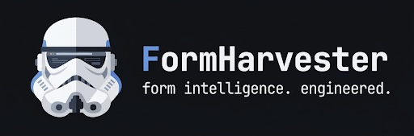

FormHarvester is an AI-assisted form intelligence engine.
It navigates the open web autonomously - executing searches, parsing page structure, extracting contact signals, and interacting with forms at the browser level. Built on async browser with stealth fingerprinting, proxy rotation, and a pluggable captcha solver interface.

## Adjusting config.txt

#### `mode`
The CSV that will be used by the bot (e.g. `mode = lawn` will use `lawn.csv`)

#### `max_google_pages`
The CSV that will be used by the bot (e.g. `mode = lawn` will use `lawn.csv`)

#### `skip_ads`
FormHarvester will skip any ads on Google Search.

#### `start_page`
FormHarvester will start on X google page.

#### `send_form`
FormHarvester will send the form inside the website. It can be disabled to save time.

#### `generate_email_sources`
Generate an extra file showing the source URL where the email was extracted.

#### `hide_browser`
This setting will run the browser in headless mode and it will be hidden.

#### `max_time`
Max time FormHarvester can spend on a single website.

#### `min_delay` and `max_delay`
A random delay between `min` and `max` will be used for google.

#### `captcha_sleep`
Sleep for `X` minutes after a Google captcha is found. 0 to disable.

#### `search_timer`
A waiting time (in minutes) between the last google search and the next one.

#### `[captcha]`
Configure an automatic captcha solver. Set `provider` to `deathbycaptcha`,
`2captcha`, or `none` (blank auto-detects from whichever credentials you fill in):

```ini
[captcha]
provider = 2captcha
dbc_username =
dbc_password =
twocaptcha_api_key = your_2captcha_key
```

#### `[dev]`
Disable in production. They are used for development reasons. `debug_form` may be useful, as it prevents the form from submitting.


## How to run
#### Executable
`Run formharvester.exe`

#### Python
```bash
pip install -e .
formharvester          # runs the config-driven harvest loop (reads config.txt)
```

## Programmatic use (library API)

Since `0.2.0` FormHarvester ships a library API so you can drive the engine from
your own code - no `config.txt`, input CSV or progress files required. The CLI
is unchanged.

```python
from formharvester import FormHarvester, FormFillDetails, HarvesterOptions

details = FormFillDetails(
    first_name="Jane", last_name="Doe",
    email="jane@example.com", phone="1234567890",
    subject="Enquiry", message="Hi, I'd like a quote.",
)

with FormHarvester(details, HarvesterOptions(send_form=True, headless=True)) as fh:
    result = fh.harvest("https://acme.com")
    print(result.status, result.submitted, result.emails)

    for r in fh.harvest_many(["https://a.com", "https://b.com"]):
        print(r.url, r.status)
```

`result.status` is one of `SUBMITTED`, `FORM_NOT_FOUND`, `BUTTON_NOT_FOUND`,
`VISITED`, or `ERROR` - the same tokens the CLI writes to its progress file.
One-shot helpers `harvest_site(url, details)` and `harvest_sites(urls, details)`
are also available.

## Package layout (0.2.0)

```
src/formharvester/
├── __init__.py          # public API (FormHarvester, FormFillDetails, …)
├── api.py               # library API
├── engine/              # Selenium browser engine + Chrome driver
├── scraper/             # Google search + email scraping
├── form_handler/        # contact-page discovery, field fill, submit
├── captcha/             # solver providers (DeathByCaptcha, 2captcha) + detection
├── cli/                 # config.txt loader + run loop (`formharvester` command)
└── utils/               # root-domain, email regex, link filters
```

## Folder structure (runtime)

#### data
Where scraped emails and logs are dumped.

#### drivers
Browser drivers used by selenium.

#### input
Input CSV files go here.

#### log
This folder will report errors on websites, very useful to improve the bot.

___

This project is released under the [MIT License](LICENSE). You are free to use, modify, and distribute this software, provided that the original copyright notice and license terms are included in all copies or substantial portions of the software.
