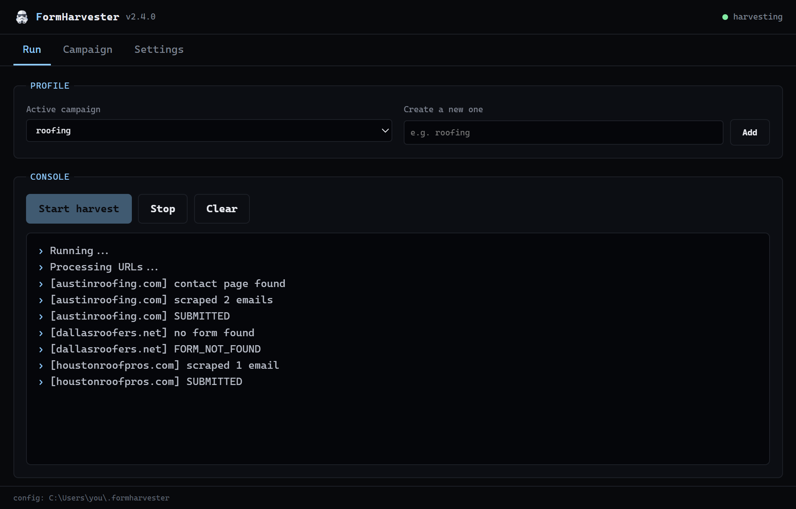

**Website:** [formharvester.com](https://formharvester.com)

FormHarvester is an AI-assisted form intelligence engine.
It navigates the open web autonomously - executing searches, parsing page structure, extracting contact signals, and interacting with forms at the browser level. Built on async browser with stealth fingerprinting, proxy rotation, and a pluggable captcha solver interface.



## How to run

#### Desktop app
[Download formharvester.exe](https://github.com/dariomory/formharvester/releases/latest/download/formharvester.exe)
(built automatically on every release by `.github/workflows/release-windows-exe.yml`), then run it.
Everything is configured in the app: no files to edit.

#### Python
```bash
pip install "formharvester[gui]"
formharvester gui      # desktop app
formharvester run      # headless harvest loop
```

The `[gui]` extra pulls in pywebview. Plain `pip install formharvester` gives
you the CLI and the library without it.

## Configuration

Settings live in `formharvester.json`, and each campaign (form-fill details plus
the search queries) lives in `profiles/<name>.json`. Run
`formharvester settings path` to see where they are stored. The location is the
working directory when a config already exists there, otherwise
`~/.formharvester`; `FORMHARVESTER_HOME` overrides both.

Scraped emails, progress files and error logs are written to `data/` and
`log/` inside that same directory.

### From the GUI

`formharvester gui` opens three tabs: **Run** picks the active campaign and
streams the live console, **Campaign** edits the form-fill details and query
list, **Settings** covers the engine, Google pacing and the captcha solver.

### From the CLI

```bash
formharvester settings show                     # print current settings
formharvester settings set engine.headless true # values are validated
formharvester settings set google.max_pages 5

formharvester profile list
formharvester profile create solar
formharvester profile use solar

formharvester run --profile solar --headless --max-pages 5
```

Flags on `run` override the saved settings for that run only.

### Settings reference

| Key | Meaning |
| --- | --- |
| `engine.send_form` | Submit the contact form once filled. Disable to save time. |
| `engine.headless` | Run the browser hidden. |
| `engine.skip_ads` | Skip ad results on Google Search. |
| `engine.max_time` | Seconds allowed per website. |
| `engine.generate_email_sources` | Also record the URL each email came from. |
| `engine.debug_form` | Fill forms but never submit them. |
| `google.start_page` | Google results page to start from. |
| `google.max_pages` | Result pages to walk per query. |
| `google.min_delay` / `google.max_delay` | Random delay range, in seconds, between searches. |
| `google.captcha_sleep` | Minutes to pause after a Google captcha. 0 disables. |
| `google.search_timer` | Minutes between search batches. |
| `captcha.provider` | `deathbycaptcha`, `2captcha`, `none`, or blank to auto-detect from the credentials you filled in. |
| `captcha.twocaptcha_api_key` | 2captcha API key. |
| `captcha.dbc_username` / `captcha.dbc_password` | DeathByCaptcha credentials. |

## Programmatic use (library API)

Since `2.4.0` FormHarvester ships a library API so you can drive the engine from
your own code - no settings files or progress files required. The CLI is
unchanged.

```python
from formharvester import FormHarvester, FormFillDetails, HarvesterOptions

details = FormFillDetails(
    first_name="Jane", last_name="Doe",
    email="jane@example.com", phone="1234567890",
    subject="Enquiry", message="Hi, I'd like a quote.",
)

with FormHarvester(details, HarvesterOptions(send_form=True, headless=True)) as fh:
    result = fh.harvest("https://acme.com")
    print(result.status, result.submitted, result.emails)

    for r in fh.harvest_many(["https://a.com", "https://b.com"]):
        print(r.url, r.status)
```

`result.status` is one of `SUBMITTED`, `FORM_NOT_FOUND`, `BUTTON_NOT_FOUND`,
`VISITED`, or `ERROR` - the same tokens the CLI writes to its progress file.
One-shot helpers `harvest_site(url, details)` and `harvest_sites(urls, details)`
are also available.

## Package layout (2.4.0)

```
src/formharvester/
├── __init__.py          # public API (FormHarvester, FormFillDetails, …)
├── api.py               # library API
├── engine/              # Selenium browser engine + Chrome driver
├── scraper/             # Google search + email scraping
├── form_handler/        # contact-page discovery, field fill, submit
├── captcha/             # solver providers (DeathByCaptcha, 2captcha) + detection
├── settings.py          # JSON settings, profiles and file locations
├── cli/                 # typer commands (`formharvester`)
├── gui/                 # pywebview desktop app (web/ holds its HTML, CSS, JS)
└── utils/               # root-domain, email regex, link filters
```

## Building the Windows executable (maintainers)

`.github/workflows/release-windows-exe.yml` builds `formharvester.exe` with PyInstaller and
attaches it to the GitHub Release for any pushed `v*` tag (also runnable manually via
workflow_dispatch). To build it locally:

```bash
uv sync --no-group dev --extra gui
uv pip install pyinstaller
uv run pyinstaller packaging/formharvester.spec
```

The executable launches the desktop app. The `formharvester` command installed
by pip is the CLI.

___

This project is released under the [MIT License](LICENSE). You are free to use, modify, and distribute this software, provided that the original copyright notice and license terms are included in all copies or substantial portions of the software.
